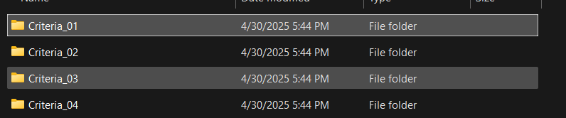

# Batch Script - Using cmd Windows

This practical guided us to create a batch script which can create multiple folders at a time once we execute the .bat file.

1. Open a text editor

* :: - commenting in .bat file
* mkdir - make directory
* cd - current directory
* cd .. - back to the pervious/parent directory

2. Type the following script

```

mkdir Criteria_01
cd Criteria_01

:: Making sub directories
mkdir Standard_01
mkdir Standard_02
mkdir Standard_03
mkdir Standard_04

cd ..

mkdir Criteria_02

cd criteria_02

mkdir Criteria_03

cd Criteria_03

mkdir Standard_01 
mkdir Standard_02 
mkdir Standard_03 

cd ..  

mkdir Criteria_04  
``` 

3. Save the code as a .bat file 
4. Execute the file. Which creates 4 main directories and with some subdirectories.


### Output Screenshots

1. Once you created a .bat file it shows like this. 


2. Double click on the icon to execute the file. 
3. After the execution 

